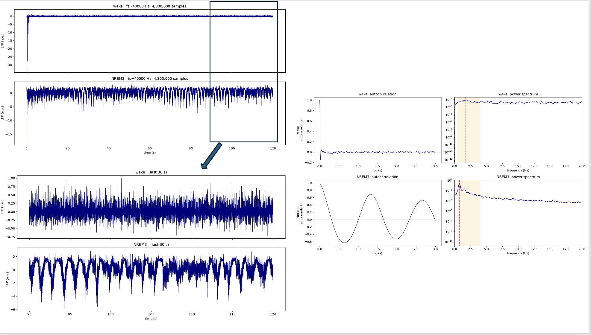

# Exploratory thalamocortical modeling of encephalopathic slowing and RDA

This repository extends [Fink et al.'s NEURON port](https://pubmed.ncbi.nlm.nih.gov/39345726/) of the [Krishnan et al. thalamocortical sleep model](https://doi.org/10.7554/eLife.18607). It tests parameter combinations that may produce diffuse background slowing and/or brief 0.5--4 Hz GRDA-like trains.

No sepsis-specific biology or new oscillators have been added. The parameters are not derived from real patient data nor any validated
model of sepsis-associated encephalopathy.

- [State atlas (states 5--45)](docs/figures/SAE_state_atlas_states_5_to_45_seed1.pdf)
- [State definitions and hypotheses](SAE_STATE_MATRIX.md)
- Results: [all states](docs/figures/state_atlas_metrics_seed1.csv) and [repeated runs](docs/figures/lead_replication_metrics_seeds1_to_3.csv)
- [Fink et al.'s original README](README_FINK_ET_AL.md)

## What changed from Fink et al.

The underlying receptor and channel mechanisms are unchanged. Synaptic, intrinsic, and GABA-A timing parameters were modified (preserving original defaults). GABA-A and GABA-B receptor mechanisms existed but scaled multiple pathway strengths shared a single multiplier; these were separated.

| File | Change |
|---|---|
| `config.py` | Adds experimental states and configurable synaptic and intrinsic parameters. |
| `bazh_net.py` | Applies settings, records parameters, and labels outputs by state and run. |
| `network_class.py` | Separates six thalamic connections that previously shared gains. |
| `cell_classes.py` | Makes selected pyramidal-cell conductances configurable. |

Fink et al.'s README is preserved unchanged.

## Experimental path

Wake (state 0) N3 (state 2) were each run for 120 simulated seconds
To test different parameter combos, novel states 5--48 were each run for 120 simulated seconds. 
This was done iteratively a few states at a time, building on knowledge from all prior runs. 
Due to promising initial results, states 35, 38, 39, and 40 were tested across three random seeds, as was N3 for comparison. 

**Recurrent cortical drive** refers to the PYR->PYR AMPA-D2 gain, which
controls pyramidal-cell self-excitation but may also affect miniature events.
TC and RE are thalamocortical relay and reticular neurons.

### Approach 1: start near wake and induce slowing (states 5--33)

| States | Hypothesis family | Result |
|---:|---|---|
| 5--6 | Combined reduced cortical excitation, stronger inhibition, and altered K leak to test a low-excitability SAE hypothesis. | Both states suppressed network activity too strongly (~flat output). |
| 7--8 | Restored only recurrent cortical drive on the state-5/6 backgrounds, to test whether inadequate self-excitation caused suppression. | Activity returned as sharp packets rather than a continuous slow background. |
| 9--12 | Built a milder N1-like wake-to-N2 bridge and separated cortical recurrence, cortical E/I, and thalamic recruitment tests. | Stable active backgrounds with only modest slowing; state 11 became the background anchor. |
| 13--15 | Prolonged cortical, thalamic, or both GABA-A decay constants by 1.5x. | Propofol-inspired kinetic sensitivity tests, not SAE calibration; no compelling target phenotype. |
| 16--18 | Increased recurrent drive and cortical K leak together along the wake-to-N2 axis. | State 17 produced repeated theta packets. State 18 entered a low-output, fast-dominated regime (about 24% delta; centroid 11.2 Hz), not the target. |
| 19--24 | Perturbed separated thalamic pathways. | Packet incidence/duration changed, but frequency remained approximately 6.4--6.9 Hz: theta, not delta. |
| 25--29 | Tested TC Ih/K-leak timing and PYR dendritic NaP/Km/KCa modules. | Changed packet recruitment without reaching the target phenotype. |
| 30--33 | Fine-bracketed recurrence alone versus recurrence with matched cortical K leak. | Located a transition into theta packets; packet-free states showed only modest slowing. |

These wake-based tests produced suppression, modest slowing, or theta packets rather than the target. 
This approach did exhaustively sweep through all parameters. 
Additional avenues to explore could be: 
Nonetheless, a pivot was made: start from N3 and weaken sleep organization while retaining slow activity.

### Approach 2: start from N3 and remove sleep organization (states 34--48)

| States | Hypothesis family | Result |
|---:|---|---|
| 34--40 | Reduced cortical recurrence/leak or altered thalamic inhibition and membrane properties. | States 35 and 40 produced consistent irregular slowing. State 38 remained N3-like; state 39 varied across runs. |
| 41--44 | Fine-tuned recurrent drive, with or without matched cortical K leak. | State 42 was the best initial irregular-slow candidate; state 44 was slowest (~93% delta) but looked more like organized N3. Both need replication. |
| 45--48 | Transferred the state-39 thalamic module or state-38 fast RE->TC GABA-A change onto states 35/40. | State 45 developed intermittent ~6.5-Hz theta packets; state 46 had smaller fast bouts. States 47/48 gave little morphological improvement. |

## Current results

Values below are mean +/- SD across three runs with different random seeds,
analyzed over 10--119 seconds. See `analyze_lfp_states.py` for details.

| State | Delta power | Spectral centroid | Interpretation |
|---:|---:|---:|---|
| N3 | 96.5 +/- 0.9% | 1.28 +/- 0.13 Hz | Slow-sleep reference. |
| 35 | 78.7 +/- 0.5% | 3.21 +/- 0.03 Hz | Most consistent irregular diffuse slowing. |
| 38 | 97.0 +/- 0.8% | 1.22 +/- 0.13 Hz | Consistently slow but essentially N3-like. |
| 39 | 92.2 +/- 4.2% | 1.84 +/- 0.56 Hz | Regularity varied across runs; not robust RDA. |
| 40 | 84.9 +/- 1.3% | 2.57 +/- 0.16 Hz | Consistent slowing, less organized than N3. |

States 42 and 44 are promising one-run leads but need repeat testing. **No
state yet provides a robust, validated GRDA phenotype.** The clearest result
is a continuum from irregular slowing (states 35/40) to organized N3-like
slowing (state 38, and state 44 in its first run).

## Analysis and atlas



The atlas contains one page for each state 5--45, labeled `state_n`, showing the full 120-second trace and final 30 seconds. Traces are filtered to 0.5--30 Hz and scaled separately for readability; amplitude and spectral measures appear on each page. The first 10 seconds are initialization.

Rebuild the atlas and metrics with:

```bash
python build_state_atlas.py
```

## Running a static state

Compile the mechanisms as described in `README_FINK_ET_AL.md`, activate the Python environment, and run a state explicitly. On the tested Apple Silicon setup with Open MPI:

```bash
export MPI_LIB_NRN_PATH=$(brew --prefix open-mpi)/lib/libmpi.dylib
FINK_STATE=35 FINK_SEED=1 FINK_DURATION_MS=120000 \
  mpiexec -n 8 nrniv -mpi -python bazh_net.py 2>&1 | tee run_state35_seed1.log
```

Outputs are named by state, seed, and MPI rank count. A 120-second run took approximately 11--12 minutes under otherwise light load. See
`requirements.txt` for tested Python packages; MPI is a system dependency.

## Limitations
- Most states have one run; N3 and states 35/38/39/40 have three.
- One local cortical LFP cannot establish the bilaterally synchronous,
  symmetric distribution required for clinical **generalized** RDA, nor can
  this model establish awareness or stimulus reactivity. The honest current
  label is RDA-like.
- Slow power alone cannot distinguish encephalopathy from N3. Morphology,
  stationarity, population participation, state responsiveness, and spatial
  organization require separate validation.
- Parameter changes are mechanistic probes, not measurements from septic
  human or animal brains.
- Raw outputs are excluded from GitHub because they total several gigabytes.

Exploratory modifications by Graham McLeod with computational assistance from
OpenAI Codex. Original authorship and GPL-2 licensing are preserved.
